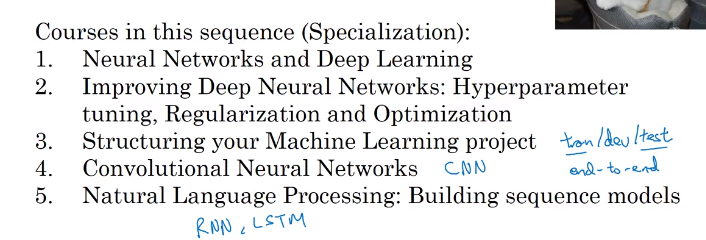
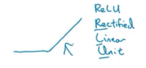
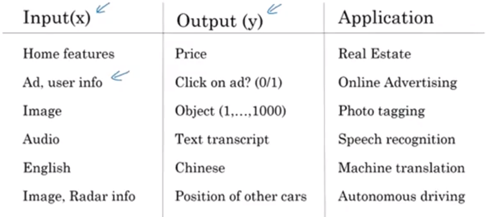
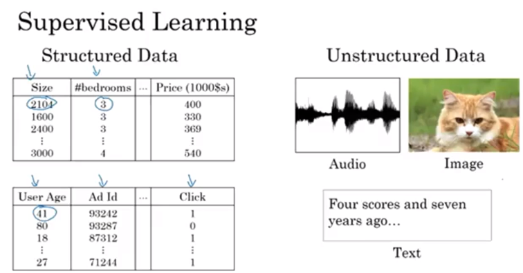
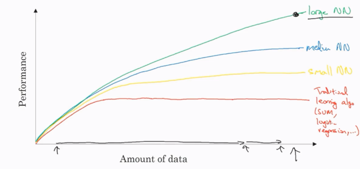
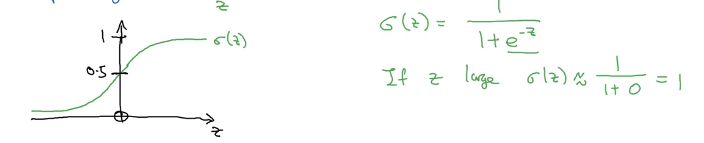
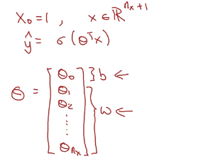
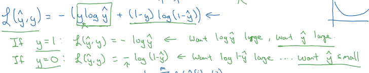
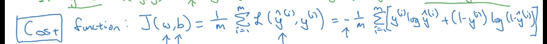

[TOC]

### 1.Introduction

- 课程安排：

- ReLU(Rectified Linear Unite)：线性整流函数

- 目前应用：

- 各类算法中数据与预测准确率的关系：

### 2.Neural Network Basics

- Binary Classification:

  - $m/m_{train}$表示训练集的样本数目
  - 将每个样本的元素reshape成列向量并将训练集中m个列向量放在一起组成一个矩阵X，在python中$X.shape=(n_x,m)$，$n_x$表示每个样本的像素总数，即$h \times w \times channels $
  - 将样本的标签排成行向量，记作Y，Y.shape=(1,m)

- Logistic Regression:

  - sigmoid function:

    

  - 将偏差放入X矩阵的表示方法：

    

- Logistic Regression cost function:

  - loss function:

    

  - cost function:

    

